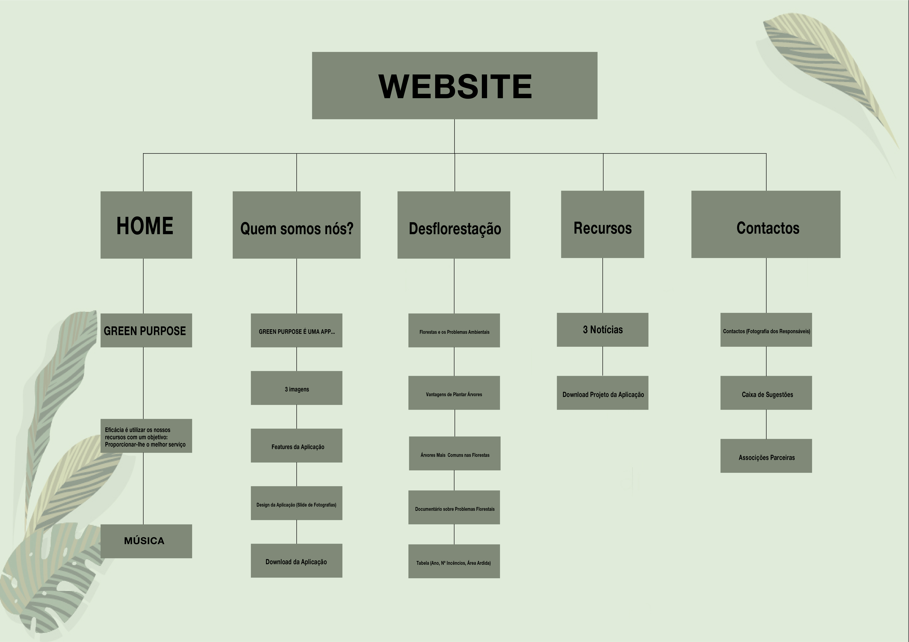

# **1.** **PROJECT PRESENTATION - APRESENTAÇÃO DO TRABALHO**
## **Tema** - Floresta
## **Subtema** - App desenvolvida para a cadeira de Comunicação e Design sobre a Reflorestação
Para este trabalho final, decidimos aproveitar um trabalho que estamos a desenvolver
para outra cadeira, cujo tema é a reflorestação, e que consiste em os utilizadores
contribuírem monetariamente para apoiar a plantação de arvores.
Como tal, a nossa página Web vai ter como tema a “Green Purpose”, que é o nome da
nossa aplicação. Ao entrar na nossa página web, as pessoas vão se deparar com alguma
imagem de fundo relativa ao tema e também com o nosso logotipo. Além disso, temos
intenção disponibilizar uma música para os utilizadores ouvirem enquanto navegam na
página. Na parte superior as pessoas vão ter acesso a um menu rápido, para ser mais
rápida e organizada a utilização e ser uma alternativa ao scroll, com os seguintes
tópicos:
- Quem somos nós e o nosso objetivo
 Depois de clicar neste tópico, as pessoas vão ser direcionadas a uma parte onde vão
ter acesso a uma pequena introdução sobre a nossa aplicação (quem somos nós,
objetivo, funcionalidades, etc). Além disso, vão ter acesso a algumas imagens do design
da nossa aplicação, juntamente com algumas instruções de como usar a nossa
aplicação.
- Desflorestação e as suas causas
 Esta parte vai ser dedicada a explicar as causas e os fatores da desflorestação, e vamos
ter alguns dados organizados em tabelas e em listas organizadas. Além disso,
pretendemos ter imagens a passar automaticamente, em modo slider.
-Recursos
 Neste tópico, pretendemos disponibilizar algumas hiperligações uteis relacionadas
com este tema, como por exemplo, associações com este fim, noticias relevantes e
ainda todo o projeto envolvente da nossa aplicação para download.
-Contactos Importantes
 Neste último tópico, vamos disponibilizar contactos oportunos como por exemplo a
proteção civil e proteção florestal. Vamos ainda disponibilizar um formulário para os
utilizadores colocarem as suas perguntas, e essas irem diretamente para o nosso email. Vamos colocar 3 fotografias de nós os três com o nosso e-mail e nome para o caso de terem alguma dúvida.

Para finalizar, pretendemos colocar a hora e data na parte inferior da página web

Como é óbvio não realizamos todos os passos da maneira que queriamos portanto o site sofreu algumas alterações:
- Data e hora apresentada no canto superior esquerdo do website;
- A música estará apenas presente na página inicial;
- Intruções da Página estática HTML "Quem Somos Nós" removida;
- Fotografias em Modo Slide convertidas em estáticas na página estática HTML "Desflorestação";
- Hiperligações das associações com este fim colocadas na página estática HTML "Contactos";
- Contactos oportunos como a proteção civil e proteção florestal removidos da página estática HTML "Contactos".

# **2** **INTERFACE COM O UTILIZADOR**
## - _Site Map_ 

## - _Sketch_

## - _Resultado Final_

# **3** **PRODUCT - PRODUTO**
## **- Descrição do Produto**  
#### É um site informativo que visa a propaganda e o suporte da aplicação "Green Purpose"desenvolvida na unidade curricular de Design e Comunicação Thinking; 

## **- Regras de utilização** 
#### Não é necessário qualquer registo de inicio de sessão de conta; 

## **- Ajuda à navegação**
#### O nosso menu encontra-se organizado horizontalmente no canto superior direito e encontra-se numa position fixa de forma a que o utlizador tenha acesso ao menu enquanto dá scroll na página. Colocamos todo o tipo de informação importante em grande escala para não passar à vista de ninguém;

## **- Validação do HTML e CSS**

## **- Detalhes de Implementação**
-  O docente pediu 4 páginas estáticas e nós implementamos 5; 
 - Data e hora;
 - Slide de Fotografias;
 - Imagens sobrepostas a outras;
 - Vídeo;
 - Música.

